# Skema Relasional Database — Portal SAQ

Dokumen ini memetakan seluruh tabel dari file migration di `database/migrations/`
ke dalam bentuk **Mermaid ER Diagram**. Diagram dibagi per modul agar mudah dibaca,
namun relasi antar-modul tetap digambarkan (lintas modul).

---

## 1. Diagram Utama (Semua Modul)

```mermaid
erDiagram
    %% ==================== MODUL AUTH & SISTEM ====================
    users {
        bigint id PK
        string email UK "nullable"
        string phone_number UK
        string password "nullable"
        boolean is_active
        string remember_token "nullable"
        datetime created_at
        datetime updated_at
    }

    otp_codes {
        bigint id PK
        bigint user_id FK "nullable"
        string phone_number "nullable"
        string otp_code
        string action_type "login | activation | reset_password"
        timestamp expires_at
        boolean is_used
        int attempts
        datetime created_at
        datetime updated_at
    }

    personal_access_tokens {
        bigint id PK
        string tokenable_type "morph"
        bigint tokenable_id "morph"
        string name
        string token UK
        text abilities "nullable"
        timestamp last_used_at "nullable"
        timestamp expires_at "nullable"
    }

    password_reset_tokens {
        string email PK
        string token
        timestamp created_at "nullable"
    }

    sessions {
        string id PK
        bigint user_id FK "nullable"
        string ip_address "nullable"
        text user_agent "nullable"
        text payload
        int last_activity
    }

    %% ==================== MODUL CORE ====================
    academic_years {
        bigint id PK
        string year_name
        boolean is_active
    }

    jenjang {
        bigint id PK
        string name UK
        int sort_order
    }

    grade_levels {
        bigint id PK
        bigint jenjang_id FK
        string name
        int sort_order
    }

    semesters {
        bigint id PK
        bigint academic_year_id FK
        string name
        date start_date
        date end_date
        boolean is_active
    }

    classrooms {
        bigint id PK
        string name UK
        int capacity "nullable"
        string location "nullable"
    }

    %% ==================== MODUL STUDENT ====================
    parents {
        bigint id PK
        bigint user_id FK "nullable"
        string phone_number UK
        string father_name "nullable"
        string mother_name "nullable"
        text address "nullable"
    }

    students {
        bigint id PK
        bigint parent_id FK
        string nisn UK "nullable"
        string full_name
        string nickname "nullable"
        string gender "L | P"
        date birth_date
        string status "aktif | mutasi | lulus"
    }

    %% ==================== MODUL ACADEMIC ====================
    class_groups {
        bigint id PK
        bigint grade_level_id FK
        bigint academic_year_id FK
        bigint classroom_id FK "nullable"
        string name
        bigint homeroom_teacher_id "nullable, BELUM FK (tabel teachers belum ada)"
    }

    class_group_students {
        bigint id PK
        bigint class_group_id FK
        bigint student_id FK
        bigint academic_year_id FK
        date moved_at
        date moved_out_at "nullable"
        bigint moved_by FK "nullable"
        text note "nullable"
    }

    report_cards {
        bigint id PK
        bigint student_id FK
        bigint class_group_id FK
        bigint semester_id FK
        text summary_notes "nullable"
        string status "draft | published"
        timestamp published_at "nullable"
    }

    %% ==================== MODUL FINANCE ====================
    billing_types {
        bigint id PK
        string name
        boolean is_recurring
    }

    payment_channels {
        bigint id PK
        string channel_type "bank_transfer | virtual_account | e_wallet | cash"
        string name
        string account_number "nullable"
        string account_holder_name "nullable"
        string provider "manual | finpay"
        string provider_channel_code "nullable"
        boolean is_active
    }

    billing_tariffs {
        bigint id PK
        bigint billing_type_id FK
        bigint academic_year_id FK
        string tariff_name
        decimal amount
    }

    student_tariff_mappings {
        bigint id PK
        bigint student_id FK
        bigint billing_tariff_id FK
        bigint academic_year_id FK
        bigint billing_type_id FK
        text note "nullable"
        bigint approved_by FK "nullable"
    }

    invoices {
        bigint id PK
        bigint student_id FK
        bigint academic_year_id FK
        bigint created_by FK "nullable"
        string invoice_number UK
        int period_month
        int period_year
        date due_date "nullable"
        decimal total_amount
        string status "unpaid | partial | paid | cancelled"
    }

    invoice_items {
        bigint id PK
        bigint invoice_id FK
        bigint billing_type_id FK
        string item_name "snapshot nama item"
        decimal amount
    }

    payment_gateway_transactions {
        bigint id PK
        bigint invoice_id FK
        bigint payment_channel_id FK "nullable"
        string gateway_reference_id UK
        string gateway_trx_id "nullable"
        string status "pending | paid | expired | failed | cancelled"
        decimal amount
        timestamp expired_at "nullable"
        timestamp paid_at "nullable"
        json raw_request "nullable"
        json raw_response "nullable"
    }

    webhook_logs {
        bigint id PK
        string provider
        json payload
        json headers "nullable"
        boolean signature_valid
        boolean processed
        bigint payment_gateway_transaction_id FK "nullable"
    }

    invoice_payments {
        bigint id PK
        bigint invoice_id FK
        bigint payment_channel_id FK
        bigint payment_gateway_transaction_id FK "nullable"
        string reference_number "nullable"
        decimal amount_paid
        datetime paid_at
        bigint handover_by FK "nullable"
    }

    %% ==================== MODUL RBAC (Spatie Permission) ====================
    roles {
        bigint id PK
        string name
        string guard_name
    }

    permissions {
        bigint id PK
        string name
        string guard_name
    }

    model_has_roles {
        bigint role_id FK
        string model_type
        bigint model_id
    }

    model_has_permissions {
        bigint permission_id FK
        string model_type
        bigint model_id
    }

    role_has_permissions {
        bigint permission_id FK
        bigint role_id FK
    }

    %% ==================== RELASI / RELATIONSHIPS ====================

    %% Auth & Sistem
    users ||--o{ otp_codes : "memiliki OTP"
    users ||--o{ sessions : "login session"
    users o|--o{ personal_access_tokens : "tokenable (morph)"

    %% Profil orang tua terhubung ke akun user
    users o|--o| parents : "profil orang tua"
    parents ||--o{ students : "memiliki anak"

    %% RBAC
    users o|--o{ model_has_roles : "assign role (morph)"
    users o|--o{ model_has_permissions : "assign permission (morph)"
    roles ||--o{ model_has_roles : "dimiliki user"
    permissions ||--o{ model_has_permissions : "dimiliki user"
    roles ||--o{ role_has_permissions : "granted"
    permissions ||--o{ role_has_permissions : "granted to"

    %% Core
    jenjang ||--o{ grade_levels : "tingkatan"
    academic_years ||--o{ semesters : "periode"
    academic_years ||--o{ class_groups : "tahun ajaran"
    grade_levels ||--o{ class_groups : "level kelas"
    classrooms o|--o{ class_groups : "lokasi ruang"

    %% Academic
    class_groups ||--o{ class_group_students : "anggota rombel"
    class_groups ||--o{ report_cards : "rapor dikeluarkan"
    students ||--o{ class_group_students : "riwayat rombel"
    students ||--o{ report_cards : "menerima rapor"
    semesters ||--o{ report_cards : "rapor per semester"
    academic_years ||--o{ class_group_students : "periode"
    users o|--o{ class_group_students : "moved_by (admin)"

    %% Finance - Master Tarif
    billing_types ||--o{ billing_tariffs : "jenis tagihan"
    academic_years ||--o{ billing_tariffs : "berlaku tahun ajaran"
    billing_tariffs ||--o{ student_tariff_mappings : "dipetakan"
    billing_types ||--o{ student_tariff_mappings : "jenis"
    students ||--o{ student_tariff_mappings : "pemetaan tarif"
    academic_years ||--o{ student_tariff_mappings : "tahun ajaran"
    users o|--o{ student_tariff_mappings : "approved_by (approval)"

    %% Finance - Invoice & Pembayaran
    students ||--o{ invoices : "tagihan"
    academic_years ||--o{ invoices : "tahun ajaran"
    users o|--o{ invoices : "created_by (admin)"
    invoices ||--o{ invoice_items : "rincian item"
    billing_types ||--o{ invoice_items : "referensi jenis"
    invoices ||--o{ payment_gateway_transactions : "transaksi gateway"
    payment_channels ||--o{ payment_gateway_transactions : "kanal pembayaran"
    invoices ||--o{ invoice_payments : "pembayaran"
    payment_channels ||--o{ invoice_payments : "kanal"
    payment_gateway_transactions ||--o{ invoice_payments : "referensi trx gateway"
    payment_gateway_transactions ||--o{ webhook_logs : "log callback"
    users o|--o{ invoice_payments : "handover_by (kasir)"
```

---

## 2. Ringkasan Relasi Antar-Tabel

### Modul Auth & Sistem

| Tabel                    | Relasi                            | Tabel Tujuan     | Tipe Relasi                    | Keterangan                                   |
| ------------------------ | --------------------------------- | ---------------- | ------------------------------ | -------------------------------------------- |
| `otp_codes`              | `user_id` → `users.id`            | users            | N:1 (nullable, cascade delete) | Kode OTP untuk login/aktivasi/reset password |
| `sessions`               | `user_id` → `users.id`            | users            | N:1 (nullable)                 | Session login                                |
| `personal_access_tokens` | `tokenable_id` + `tokenable_type` | morph ke `users` | Polymorphic                    | Token Sanctum (mobile API)                   |
| `password_reset_tokens`  | —                                 | —                | —                              | Tabel mandiri (key = email)                  |

### Modul Core

| Tabel          | Relasi                                   | Tabel Tujuan     | Tipe Relasi                    | Keterangan                                                                |
| -------------- | ---------------------------------------- | ---------------- | ------------------------------ | ------------------------------------------------------------------------- |
| `grade_levels` | `jenjang_id` → `jenjang.id`              | jenjang          | N:1 (cascade delete)           | Tingkat kelas per jenjang (PAUD/TK/SD…)                                   |
| `semesters`    | `academic_year_id` → `academic_years.id` | academic_years   | N:1 (cascade delete)           | Semester (Ganjil/Genap) per tahun ajaran                                  |
| `class_groups` | `grade_level_id` → `grade_levels.id`     | grade_levels     | N:1 (restrict)                 | Rombongan belajar                                                         |
| `class_groups` | `academic_year_id` → `academic_years.id` | academic_years   | N:1 (restrict)                 |                                                                           |
| `class_groups` | `classroom_id` → `classrooms.id`         | classrooms       | N:1 (nullable, null on delete) | Ruang fisik                                                               |
| `class_groups` | `homeroom_teacher_id`                    | _(belum ada FK)_ | —                              | **Belum** FK — tabel `teachers` belum dibuat; ditambahkan nanti via ALTER |

### Modul Student

| Tabel      | Relasi                     | Tabel Tujuan | Tipe Relasi                    | Keterangan                    |
| ---------- | -------------------------- | ------------ | ------------------------------ | ----------------------------- |
| `parents`  | `user_id` → `users.id`     | users        | 1:1 (nullable, null on delete) | Profil orang tua + akun login |
| `students` | `parent_id` → `parents.id` | parents      | N:1 (restrict)                 | Siswa di bawah orang tua      |

### Modul Academic

| Tabel                  | Relasi                                   | Tabel Tujuan   | Tipe Relasi                    | Keterangan                           |
| ---------------------- | ---------------------------------------- | -------------- | ------------------------------ | ------------------------------------ |
| `class_group_students` | `class_group_id` → `class_groups.id`     | class_groups   | N:1 (restrict)                 | Tabel **histori** kepindahan rombel  |
| `class_group_students` | `student_id` → `students.id`             | students       | N:1 (cascade delete)           |                                      |
| `class_group_students` | `academic_year_id` → `academic_years.id` | academic_years | N:1 (restrict)                 |                                      |
| `class_group_students` | `moved_by` → `users.id`                  | users          | N:1 (nullable, null on delete) | Admin yang memindahkan               |
| `report_cards`         | `student_id` → `students.id`             | students       | N:1 (cascade delete)           | Rapor per semester                   |
| `report_cards`         | `class_group_id` → `class_groups.id`     | class_groups   | N:1 (restrict)                 |                                      |
| `report_cards`         | `semester_id` → `semesters.id`           | semesters      | N:1 (restrict)                 | Unik: 1 rapor per siswa per semester |

### Modul Finance

| Tabel                          | Relasi                                                               | Tabel Tujuan                 | Tipe Relasi                    | Keterangan                               |
| ------------------------------ | -------------------------------------------------------------------- | ---------------------------- | ------------------------------ | ---------------------------------------- |
| `billing_tariffs`              | `billing_type_id` → `billing_types.id`                               | billing_types                | N:1 (restrict)                 | Tarif per jenis tagihan per tahun ajaran |
| `billing_tariffs`              | `academic_year_id` → `academic_years.id`                             | academic_years               | N:1 (restrict)                 |                                          |
| `student_tariff_mappings`      | `student_id` → `students.id`                                         | students                     | N:1 (restrict)                 | Tarif khusus per siswa                   |
| `student_tariff_mappings`      | `billing_tariff_id` → `billing_tariffs.id`                           | billing_tariffs              | N:1 (restrict)                 |                                          |
| `student_tariff_mappings`      | `academic_year_id` → `academic_years.id`                             | academic_years               | N:1 (restrict)                 |                                          |
| `student_tariff_mappings`      | `billing_type_id` → `billing_types.id`                               | billing_types                | N:1 (restrict)                 |                                          |
| `student_tariff_mappings`      | `approved_by` → `users.id`                                           | users                        | N:1 (nullable, null on delete) | Pihak yang menyetujui                    |
| `invoices`                     | `student_id` → `students.id`                                         | students                     | N:1 (restrict)                 | Tagihan per siswa                        |
| `invoices`                     | `academic_year_id` → `academic_years.id`                             | academic_years               | N:1 (restrict)                 |                                          |
| `invoices`                     | `created_by` → `users.id`                                            | users                        | N:1 (nullable, null on delete) | Pembuat invoice                          |
| `invoice_items`                | `invoice_id` → `invoices.id`                                         | invoices                     | N:1 (cascade delete)           | Item rincian tagihan                     |
| `invoice_items`                | `billing_type_id` → `billing_types.id`                               | billing_types                | N:1 (restrict)                 |                                          |
| `payment_gateway_transactions` | `invoice_id` → `invoices.id`                                         | invoices                     | N:1 (restrict)                 | Transaksi ke payment gateway (Finpay)    |
| `payment_gateway_transactions` | `payment_channel_id` → `payment_channels.id`                         | payment_channels             | N:1 (nullable, restrict)       | Kanal yang dipakai                       |
| `webhook_logs`                 | `payment_gateway_transaction_id` → `payment_gateway_transactions.id` | payment_gateway_transactions | N:1 (nullable, null on delete) | Log callback gateway                     |
| `invoice_payments`             | `invoice_id` → `invoices.id`                                         | invoices                     | N:1 (restrict)                 | Pembayaran yang masuk                    |
| `invoice_payments`             | `payment_channel_id` → `payment_channels.id`                         | payment_channels             | N:1 (restrict)                 |                                          |
| `invoice_payments`             | `payment_gateway_transaction_id` → `payment_gateway_transactions.id` | payment_gateway_transactions | N:1 (nullable, restrict)       |                                          |
| `invoice_payments`             | `handover_by` → `users.id`                                           | users                        | N:1 (nullable, null on delete) | Petugas/kasir penerima                   |

### RBAC (Spatie Permission)

| Tabel                   | Relasi                             | Tabel Tujuan | Tipe Relasi   | Keterangan                      |
| ----------------------- | ---------------------------------- | ------------ | ------------- | ------------------------------- |
| `role_has_permissions`  | `permission_id` → `permissions.id` | permissions  | N:1 (cascade) | Pivot permission ↔ role         |
| `role_has_permissions`  | `role_id` → `roles.id`             | roles        | N:1 (cascade) |                                 |
| `model_has_roles`       | `role_id` → `roles.id`             | roles        | N:1 (cascade) | Pivot user (model) ↔ role       |
| `model_has_permissions` | `permission_id` → `permissions.id` | permissions  | N:1 (cascade) | Pivot user (model) ↔ permission |

---

## 3. Konvensi Penting dari Kode

1. **`class_group_students` adalah tabel histori.** Satu siswa dapat memiliki banyak baris
   (jika pindah rombel). Baris dengan `moved_out_at IS NULL` = rombel aktif saat ini.
   Aturan "1 baris aktif per siswa per tahun ajaran" **ditegakkan di level aplikasi**
   (`TransferStudentAction`), bukan di level database.

2. **`homeroom_teacher_id` pada `class_groups` belum menjadi FK.** Tabel `teachers`
   belum ada. Saat modul Teacher digarap, FK akan ditambahkan lewat ALTER TABLE
   secara _additive_ (tidak mengubah data lama).

3. **`invoice_items.item_name` adalah snapshot.** Nama item disalin saat invoice dibuat
   agar perubahan nama `billing_types` di kemudian hari tidak mengubah invoice lama.

4. **Unik constraint penting:**
    - `invoices`: unik per `(student_id, academic_year_id, period_month)` → 1 invoice
      per siswa per bulan per tahun ajaran.
    - `student_tariff_mappings`: unik per `(student_id, academic_year_id, billing_type_id)`
      → 1 tarif khusus per jenis tagihan per tahun ajaran.
    - `report_cards`: unik per `(student_id, semester_id)`.
    - `grade_levels`: unik per `(jenjang_id, name)`.
    - `semesters`: unik per `(academic_year_id, name)`.
    - `class_groups`: unik per `(grade_level_id, academic_year_id, name)`.

5. **`users` adalah pusat identitas.** Baik `parents`, `sessions`, `otp_codes`,
   `invoice_payments.handover_by`, `invoices.created_by`, `class_group_students.moved_by`,
   maupun RBAC (`model_has_roles`, `model_has_permissions`) semuanya merujuk kembali ke `users`.
